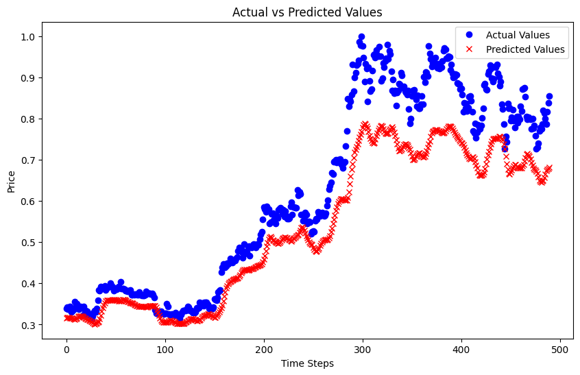

# README: Bitcoin Price Prediction Using Time Series Forecasting

## 1. Introduction to Time Series Forecasting

Time series forecasting is a technique used to predict future values based on previously observed values over time. It involves analyzing historical data points collected at consistent intervals to identify trends, seasonal patterns, and cyclical behavior. This methodology is particularly significant in financial markets, where understanding price movements can inform investment decisions.

Forecasting Bitcoin (BTC) prices is valuable due to the cryptocurrency's volatility and potential for high returns. Accurate predictions can aid swing traders in making informed decisions about entry and exit points, thereby optimizing their trading strategies. The dataset used in this project was obtained from Investing.com, which makes historical Bitcoin price data publicly available, providing a valuable resource for analysis and forecasting.

## 2. Preprocessing Method

Preprocessing is a crucial step in preparing the dataset for model training. The following steps were undertaken:

1. **Date Conversion**: Converted the 'Date' column to a datetime format to facilitate chronological sorting.

    ``` python
    data['Date'] = pd.to_datetime(data['Date'])
    ```

2. **Handling Numeric Columns**: Removed commas from numeric columns and converted them to float types.

    ``` python
    data['Price'] = data['Price'].str.replace(',', '').astype(float)
    ```

3. **Volume Conversion**: Transformed the 'Vol.' column, handling various suffixes ('K', 'M', 'B') to convert the values to a float format.

    ``` python
    data['Vol.'] = data['Vol.'].str.replace('K', 'e3') \
                            .str.replace('M', 'e6') \
                            .str.replace('B', 'e9') \
                            .str.replace(',', '')
    data['Vol.'] = data['Vol.'].astype(float)
    ```

4. **Percentage Change**: Removed the '%' sign from the 'Change %' column and converted it to float.

5. **Normalization**: Min-Max scaling transforms the feature values to a fixed range, typically [0, 1]. This normalization is essential when features have different scales, as it helps the model converge more quickly and effectively during training.

    ``` python
    features_to_scale = ['Price', 'Open', 'High', 'Low', 'Vol.', 'Change %']

    scaler = MinMaxScaler()
    data[features_to_scale] = scaler.fit_transform(data[features_to_scale])
    ```

These preprocessing techniques were chosen to ensure that the model receives clean, numerical data, which enhances training efficiency and prediction accuracy.

## 3. Setting Up `tf.data.Dataset` for Model Inputs

The dataset was structured using TensorFlow's `tf.data.Dataset`, which provides an efficient pipeline for feeding data into the model. 

1. **Creating Sequences**: Historical data was transformed into sequences to capture the temporal patterns necessary for forecasting.

    ``` python
    def create_sequences(data, sequence_length, forecast_horizon):
        sequences = []
        targets = []
        for i in range(len(data) - sequence_length - forecast_horizon + 1):
            sequences.append(data[i:i + sequence_length])
            targets.append(data[i + sequence_length + forecast_horizon - 1][0])
        return np.array(sequences), np.array(targets)
    ```

2. **Batching and Shuffling**: Batching helps in processing multiple samples simultaneously, while shuffling promotes better generalization.

This structure is crucial for training models on time series data, allowing for efficient data loading and processing during training.

## 4. Model Architecture

The model architecture employed is a Long Short-Term Memory (LSTM) network, which is well-suited for time series forecasting due to its ability to capture long-term dependencies in sequential data. The architecture consists of:

- Two LSTM layers, each with 64 units, separated by dropout layers to mitigate overfitting.
- A dense output layer with a single neuron to predict the next day's price.

### Model Summary

The model summary provides insights into the architecture and parameter counts, demonstrating the complexity and depth of the model.

## 5. Results and Evaluation

The performance metrics of the model were evaluated using Mean Absolute Error (MAE) and Mean Squared Error (MSE). The final training results indicated a training loss of 0.0015 and a validation loss of 0.0113, suggesting effective learning from the training data while also highlighting some potential overfitting.

### Graphical Representation

A graph illustrating the predicted vs. actual BTC prices was generated to visualize model performance. 



Insights from the results indicate that while the model captures trends reasonably well, further optimization and tuning may be necessary to improve generalization to unseen data. Observing the predicted and actual values helps identify patterns and discrepancies, which can inform future adjustments to the model and preprocessing methods.
